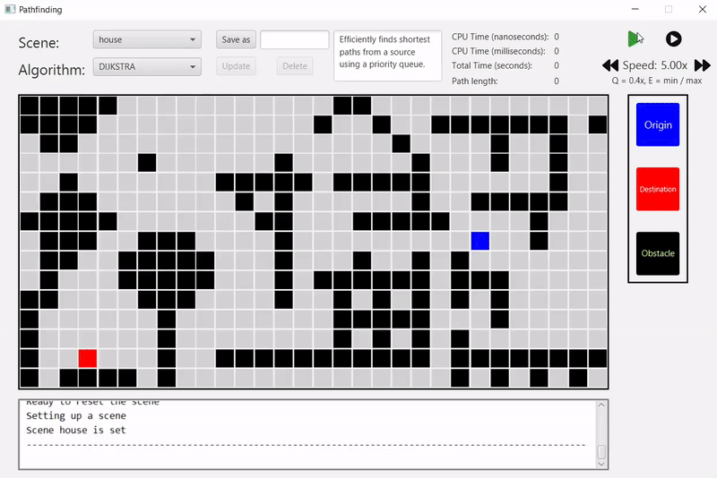

# Overview
Pathfinding Visualization is a graphical tool allowing for the visualization of various pathfinding algorithms. 
The program is written in Java language, extensively utilizing the JavaFX framework. 

  

# Authors

- **[Filip](https://github.com/Filip-Rak)**: Project Concept, UI Design, Framework.
- **[Wojtek](https://github.com/vvszewczyk)**: Implementation of Dijkstra's Algorithm.
- **[Arek](https://github.com/arekan144)**: Implementation of A* and Greedy-Search-Best Algorithms.
- **[Rafał](https://github.com/Rafallost)**: Implementation of Depth-First-Search Algorithms.

# Background
The project was developed as a final assignment for the 'Computational Geometry' course during our fourth semester at AGH University of Science and Technology in Cracow.

# Used Technologies
- **Programming Language**: Java 21.
- **Framework**: JavaFX.
- **IDE**: IntellijIDEA.

# Features
Pathfinding Visualization offers a wide range of features, including:
- **Multiple Algorithms:** Choose from 5 different pathfinding algorithms.
- **Diverse Scenes:** Test the algorithms on 7 pre-made scenes.
- **Scene Editor:** Customize the visualization with an intuitive scene editor.
- **Scene Management:** Easily add, modify, and delete scenes stored locally with the scene loader.
- **Extensible Codebase:** The code is designed to make the process of adding further pathfinding algorithms straightforward.
- **Control Visualization Speed:** Pause, speed up, or slow down the visualization to better observe the algorithm's execution.
- **Execution Time Measurements:** Track and display the execution time of each algorithm to compare performance.

# Usage Tips
## Scene Building
On the right side of the window, choose different blocks to place on the scene using the Left Mouse Button.
  - **Origin (Red):** This is the starting square for the algorithm.
  - **Destination (Blue):** The target square that the algorithm is trying to reach.
  - **Obstacles (Black):** These are impassable squares. They can be deleted using the Right Mouse Button.
 
## Scene Loader
- Pre-made scenes are editable, but changes cannot be saved directly. Use the `Save As` button to copy a scene with a custom name, making the copy editable.
- After the algorithm finishes, the scene resets to its last saved state. Use `Update` to preserve any changes you want to keep.

## Output Console
- The bottom window provides important information. Check its output for unexpected behavior.

## Speed Control
- Hold `Q` and press forward/backward buttons to adjust speed incrementally.
- Hold `E` and press forward/backward buttons for maximum speed / minimum speed.
- Avoid pressing stop button multiple times. Sometimes it may take a second for the algorithm thread to finish and UI to refresh.
  
## Time Measurement
- Please note: There is a known issue affecting the accuracy of time measurements. For precise timing, ensure you use consistent speed settings across different algorithms and avoid pausing or stopping during execution.

## Adding Custom Algorithms
To integrate custom algorithms into the project, follow these steps:

- **Clone the Repository:** Begin by cloning the project repository to your local machine.
- **Open in IntellijIDEA (or IDE of Choice):** IntellijIDEA is recommended as it was a native IDE for the project.
- **Coding Instructions:** Refer to the detailed coding examples within source files for comprehensive guidelines on implementing new algorithms.
- **Compile the Project:**

These steps will allow you to extend the functionality of the tool with your own pathfinding algorithms.

# Installation
1. **Clone the Repository:**
   - Clone the project repository to your local machine using Git.

2. **Open in IntelliJ IDEA:**
   - Open the project in IntelliJ IDEA, or any other IDE.

3. **Reload Maven Project:**
   - Right-click on the Maven project file (`pom.xml`) and select "Reload Project."
   - This process may take a minute to download dependencies and configure the project.

4. **Run the Project:**
   - Once IntelliJ IDEA has finished loading dependencies, you can run the project from within the IDE.

# Requirements

Since there is no packed `.jar` version available, ensure you have the following:

- **IDE**: IntelliJ IDEA or any IDE of your choice that supports Java development.
- **JDK**: Version 21 or higher of the Java Development Kit (JDK).
  - Ensure JDK 21 or a compatible version is installed on your system.
  - This is necessary for compiling and running the project from its source code.

